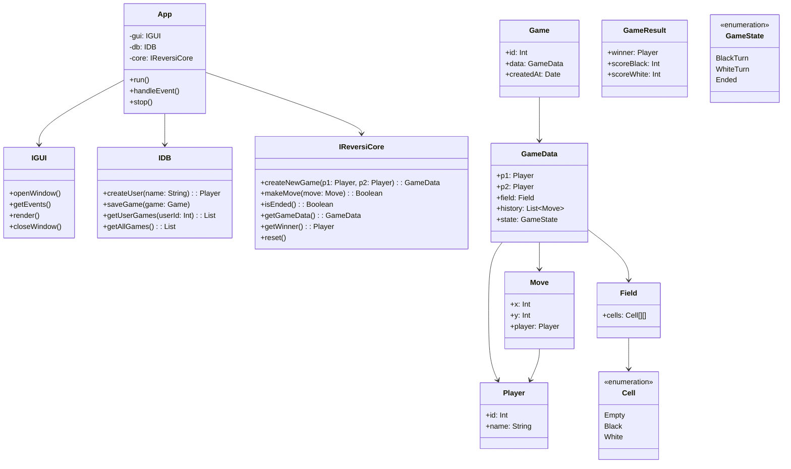

# Архитектура

## Что мы должны уметь.

1) Создать новую игру с назначенными игроками.
2) Проверить поступающие ходы на корректность.
3) Сохранить результат со всеми ходами в БД.
4) Подводить статистику по играм из БД.
5) Создавать новых ползователей.

## Основные компоненты.

GUI - Интерфейс, принимающий запросы от администратора.
DB - База данных с игроками и играми. Только хранит данные.
ReversiCore - сущность, поддерживающая процесс игры (Реверси), проверяющая правила, хранящая состояние. Не должна знать, что есть DB или GUI.
App - Приложение, которое обрабатывает события из GUI, дёргает DB, ReversiCore и GUI для ответа.

## Черновик диаграмммы классов.

#### Интерфейсы

IGUI - интерфейс для GUI.
- openWindow()
- getEvents()
- closeWindow()
- подробнее можно будет понять при попытке написании App

IDB - интерфейс для реализации прослойки с базой данных.
- createUser()
- saveGame()
- getUserGamesList()
- и т.п.

IReversiCore - интерфейс для валидации ходов, просчёта состояния поля и т.п.
- move() - валидация хода и применение в случае успеха
- createNewGame()
- isEnded()
- getGameData()
- getWinner()
- clear()
- и т.п.

#### Классы

App - класс приложения.
- gui: IGUI
- db: IDB
- core: IReversiCore
- run()
- stop()

#### Структуры

Cell: Enum (Empty, White, Black) - клетка в поле

Field: - поле игры (скорее всего N = 8, по стандартным правилам игры)
 - Array<Cell> NxN

Player: - игрок
  - name: String
  - id: int

Move: - ход
 - x: Int
 - y: Int

GameState: Enum (Ended, WhiteTurn, BlackTurn)

GameData: - все данные о текущей игре
 - p1: Player - белые
 - p2: Player - чёрные
 - field: Field
 - history: List<Move> - логи ходов с начала игры
 - state: GameState

Диаграмма:

